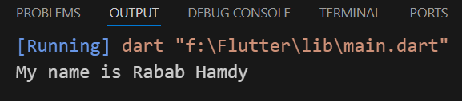
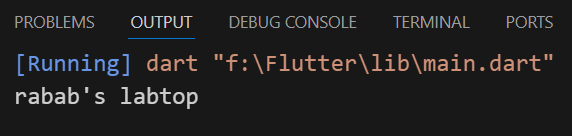
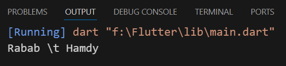
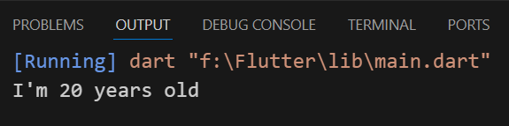
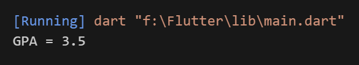
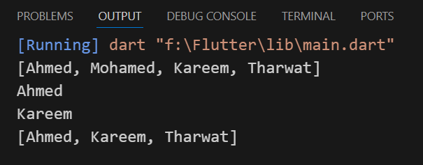
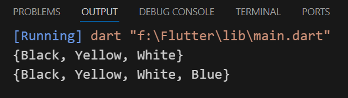
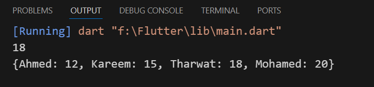

## Data Type
### 1- String data type :-
```
void main (){
  String name = 'Rabab Hamdy';
  print("My name is $name");
}
```


- Back eslash solve single quotes
```
void main(){
  String name = 'rabab\'s labtop';
  print(name);
}
```


- (\t) > tab
```
void main(){
  String name = 'Rabab\tHamdy';
  print(name);
}
```
- (\n) > new line
```
void main(){
  String name = 'Rabab Hamdy';
  print('My name is\n$name');
}
```

- (r) >> row line, ignore back eslash
```
void main(){
  String name = r'Rabab \t Hamdy';
  print(name);
}
```


---
### 2- int data type :-
```
void main(){
  int age = 20; 
  print('I\'m $age years old');
}
```


---
### 3- double data type :-
```
void main(){
  double gpa = 3.5;
  print('GPA = $gpa');
}
```


---
### 4- num data type :-
-  (int or double)
```
void main(){
  num rating = 4.5; 
  print('Movie rating is $rating');
}
```

---
### 5- boolean data type :-
-  (true or false) 
```
void main(){
  bool isOnline = true;
  print(isOnline);
}
```

---
### 6- dynamic data type :-
- use it if we don't know the type of data
- it can store (string ,int ,double ,num or bool)
```
void main(){
  dynamic name = 'Rabab';
  dynamic age = 20; 
  print(name);
  print(age);
}
```

---
### 7- var :-
- keyword automatically selects the data type
- must assign the value in the same line
```
void main(){
  var text = 'hello world'; 
  print(text);
  var years = 20; 
  print(years);
}
```

## Collection Data Type
### 1- List :-
- store values in places called index
- their arrangement begins from index 0
```
void main(){
  List<String> studentNames = ['Ahmed','Mohamed', 'Kareem', 'Tharwat'];
  print(studentNames);
  print(studentNames[0]);
  print(studentNames[2]);
  studentNames.remove('Mohamed'); //Remove item from List or Set
  print(studentNames);
}
```


---
### 2- Set :-
- store unique values (each value once)
```
void main(){
  Set<String> favColors = {'Black', 'Yellow', 'White'};
  print(favColors);
  favColors.add('Blue'); //Add item to List or Set
  print(favColors);
}
```


---
### 3- Map :-
- Each value has unique identifier (key:value)
```
void main(){
  Map<String, num> studentAges = {'Ahmed': 12, 'Kareem': 15, 'Tharwat': 18};
  print(studentAges['Tharwat']);
  studentAges['Mohamed'] = 20;
  print(studentAges);
}
```
