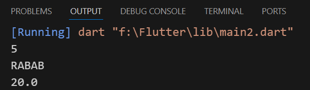
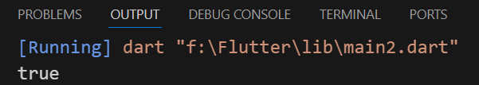

## Operators
### 1- Arithmetic operators :-
- (+ , - , * , / , %)
-  Attention to data type when using (/)
- using (~/) Print the integar number only
- (%) The remainder of the division
```
void main(){
  int number1 = 20;
  int number2 = 10;
  int result = number1 + number2;
  print(result);
}
```

---
### 2- Dot operator :-
- (.) Information or tasks for stored value
- varies depending on data type
```
void main(){
  String name = 'Rabab';
  int number = 20;
  print(name.length);
  print(name.toUpperCase());
  print(number.toDouble());
}
```


---
### 3- Comparison operators :-
- (>, <, ==, !=, >=, <=)
```
void main(){
  int mathScore = 70;
  int arabicScore = 50;
  bool isMathScoreHigher = mathScore > arabicScore;
  print(isMathScoreHigher);
}
```
