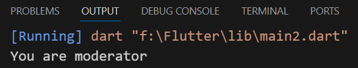

## Conditional statements
- " logical operators "

### 1- If :-
- Write condition separately to clean code
```
void main(){
  int mathScore = 70;
  int englishScore = 65;
  bool hasPassed = englishScore >= 50 && mathScore >= 50; //(AND)
  if (hasPassed) {
    print('Congratulations you passed');
  }
}
```


- Other example
```
void main(){
  bool isAdmin = false;
  bool isModerator = true;
  if (isAdmin | isModerator) {
    //(OR)
    print('You have admin or moderator permissions');
  }
}
```


---
### 2- If else :-
```
void main(){
  bool isWeatherGood = true;
  if (isWeatherGood) {
    print('We go to the sea');
    // ignore: dead_code
  } else {
    print('We go to the cinema');
  }
}
```


---
### 3- Nested if :-
```
void main(){
  bool isAdmin = false;
  bool isModerator = true;
  // ignore: dead_code
  if (isAdmin) {
    print('You are admin');
  } else if (isModerator) {
    print('You are moderator');
    // ignore: dead_code
  } else {
    print('You are user');
  }
}
```


---
### 4- Switch case :-
```
void main() {
  String grade = 'A';
  switch (grade) {
    case 'A':
      print('your grade is excellent');
      break;
    case 'B':
      print('your grade is good');
      break;
    case 'D':
      print('your grade is poor');
      break;
    case 'F':
      print('your grade is fail');
      break;
    default:
      print('invalid grade');
  }
}
```
