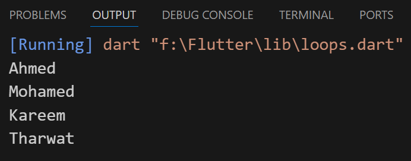
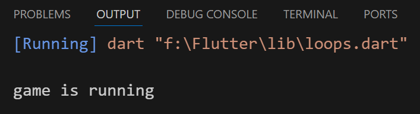

## loops
### 1- For loop :-
```
void main(){
  List<String> names = ['Ahmed','Mohamed','Kareem','Tharwat'];
  for (int i = 0; i < names.length ; i++){
    print(names[i]);
  }
}
```


---

### 2- While :-
- repeat as long as a certain condition is met (true)
```
void main(){
  bool isRunning = false;
  while (isRunning) {
    print('game is running');
  }
}
// Won't run out, condition must be true
```

---
### 3- do while :-
- The command is executed at least once even if the condition is not met
```
void main(){
  bool isRunning = false;
  do {
    print('game is running');
  } while (isRunning);
}
```


---
### 4- for in :-
```
void main(){
  List<String> names = ['Ahmed','Mohamed','Kareem','Tharwat'];
  for (var item in names) {
    print(item);
  }
}
```


---
### 5- for each :-
- May not have specified the data type
```
void main(){
  List<String> names = ['Ahmed','Mohamed','Kareem','Tharwat'];
  names.forEach((var item2) {
    print(item2);
  });
}
```
