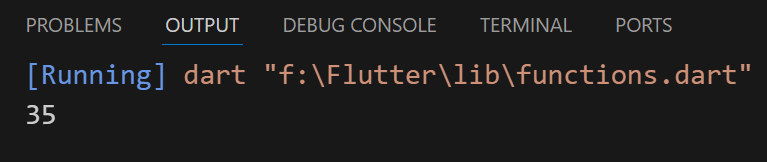
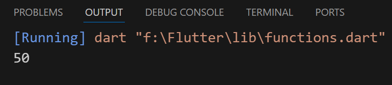
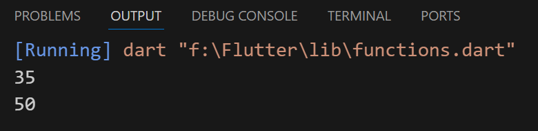

## Functions
### 1-
- implement statements only
- can't use (result) in the place where it was called
```
void main(){
  sumTwoNumbers(); //Calling the function
}
void sumTwoNumbers() {
  int number1 = 15;
  int number2 = 20;
  int result = number1 + number2;
  print(result);
}
```



---
### 2-
- return function
- can use (result) in the place where it was called
```
void main() {
  int result = sumThreeNumbers();
  int num4 = result + 5; //45 + 5 = 50
  print(num4);
}
int sumThreeNumbers() {
  int num1 = 10;
  int num2 = 15;
  int num3 = 20;
  int result = num1 + num2 + num3;
  return result;
}
```


---
---
- Two functions together
```
void main() {
  sumTwoNumbers(); //Calling the function
  int result = sumThreeNumbers();
  int num4 = result + 5; //45 + 5 = 50
  print(num4);
}

void sumTwoNumbers() {
  //can't use (result) in the place where it was called
  //implement statements only
  int number1 = 15;
  int number2 = 20;
  int result = number1 + number2;
  print(result);
}

int sumThreeNumbers() {
  //return function
  //can use (result) in the place where it was called
  int num1 = 10;
  int num2 = 15;
  int num3 = 20;
  int result = num1 + num2 + num3;
  return result;
}
```
