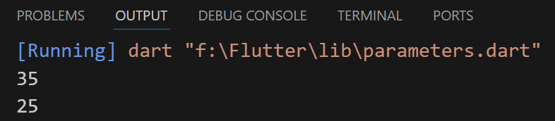
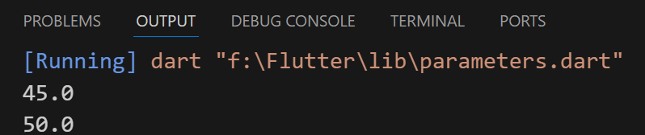

## Parameters
#### ex: 1
- (num1, num2) called parameters
- values (ex:20, 15) called arguments
```
void main(){
  int result = sumTwoNumbers(20, 15);
  print(result);

  result = sumTwoNumbers(10, 15);
  print(result);
}
int sumTwoNumbers(int num1, int num2) {
  int result = num1 + num2;
  return result;
}

// return function
```


---
#### ex: 2
- symbol [ ] means that parameter may not used (optional parameter)
- symbol ? used to solve null safety
```
void main(){
  print(calculateFinalPrice(50, 10));
  print(calculateFinalPrice(50));
}

double calculateFinalPrice(double price, [double? discount]) {
  if (discount == null) {
    discount = 0;
  }
  double finalPrice = price - price * discount / 100;
  return finalPrice;
}
```


---
#### ex: 3
- default value of discount = 0
```
void main(){
  print(calculateFinalPrice(50, 10));
  print(calculateFinalPrice(50));
}

double calculateFinalPrice(double price, [double discount = 0]) {
  double finalPrice = price - price * discount / 100;
  return finalPrice;
}
```


---
#### ex: 4
- symbol { } means that you must write the name of parameter (named parameters)
- able to switch between arguments while calling (not arranged)
```
void main(){
  print(calculateFinalPrice3(price: 50, discount: 10));
  print(calculateFinalPrice3(price: 50));
}

double calculateFinalPrice3({required double price, double discount = 0}) {
  double finalPrice = price - price * discount / 100;
  return finalPrice;
}
```
