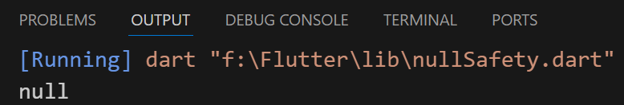
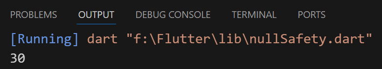
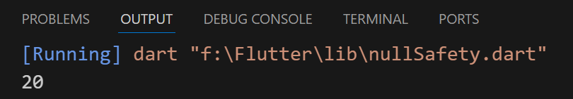
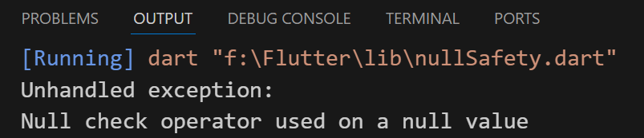

## Null safety
### Null operator (?, !, ??)

### 1- ( ? )
- Cannot use a variable whose probability value is NULL
```
void main(){
  int number2 = 15;
  int? number1;
  print(number1?.toDouble()); 

  //(?) the command was ignored
}
```


#### ex : 2
```
void main(){
  int number2 = 15;
  int? number1;
  int result;

  if (number1 != null) {
    result = number1 + number2;
    print(result);
  } else {
    number1 = 15;
    result = number1 + number2;
    print(result);
  }
}
```


---
### 2- ( ?? )
- Means equal that value if it dosn't assign value before
```
void main(){
  int? number1;
  int result;
  result = number1 ?? 20;
  print(result);
}
```


---
### 3- ( ! )
- Make sure the value of this variable is not equal NULL
```
void main(){
  int number2 = 15;
  int? number1;
  int result = number1! + number2;
  print(result);
}
```
