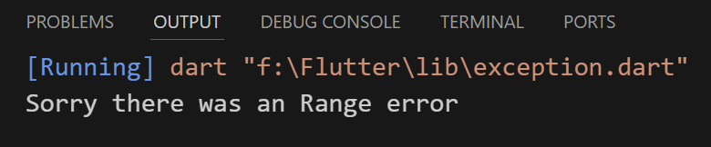

## Exception
- Problem occured while run time error

```
void main() {
  List<String> names = ['tharwat'];

  try {
    print(names[5]);
  } on RangeError {
    print('Sorry there was an Range error');
  } on HttpException {
    print('Sorry there was an HTTP exception');
  } catch (e) {
    print('Sorry there was an exception');
    print(e);
  }
}
```
