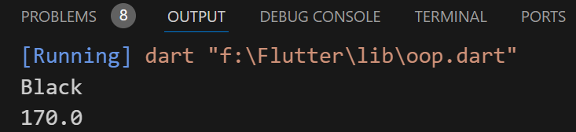
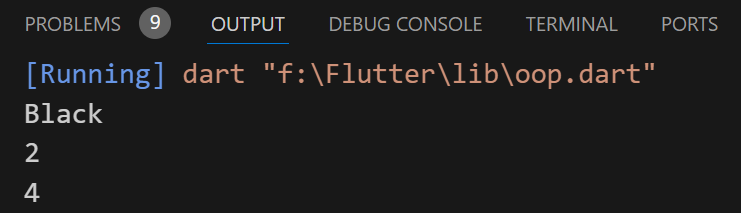
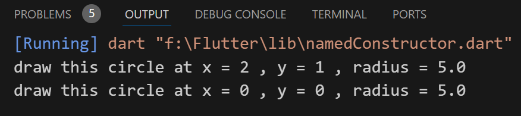
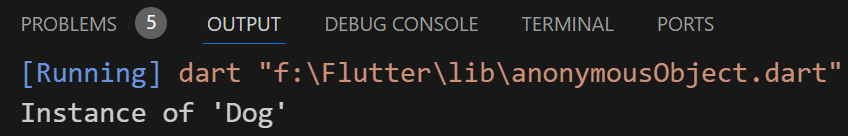
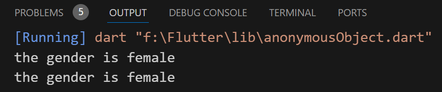
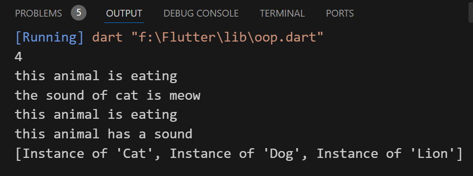

## OOP
### Classes :-
- constructor (build by default in the class, used to call the class)
- it'name is the same as the name of the class
- (encapsulation) > ( _ ) private attribute, No one outside this file can change or control it

```
class Human{
  String? hairColor;   //attributes
  double? height;
  double? weight;
  int _numberOfArms = 2;

    Human(
      {required double height,
      required double weight,
      required String hairColor}) {
    this.height = height;
    this.weight = weight;
    this.hairColor = hairColor;
  }
  // old way to create constructor
}
```

- The best way :
```
class Human {
  String? hairColor; 
  double? height;
  double? weight;
  int _numberOfArms = 2;

  Human({this.height, this.weight, this.hairColor});
}
```

- Create object from the class Human :
```
void main() {
  Human tharwat = Human(height: 170, weight: 80, hairColor: 'Black');
  print(tharwat.hairColor);
  print(tharwat.height);
}
```


---
- Methods => (function in class)
- Setter , Getter
- (Arrow function) used if we have one statement only !
- remove curly brackets from normal function && word (return)
- ex :
```
class Human {
  String? hairColor; 
  double? height;
  double? weight;
  int _numberOfArms = 2;

  Human({this.height, this.weight, this.hairColor});

  set numberOfArms(int numberOfArms) {
    if (numberOfArms <= 2 && numberOfArms >= 0) {
      this._numberOfArms = numberOfArms;
    }
  }

  int get numberOfArms => this._numberOfArms;
  // int getNumberOfArms() => this._numberOfArms;
}
```

```
void main() {

  Human tharwat = Human(height: 170, weight: 80, hairColor: 'Black');

  print(tharwat.hairColor);
  tharwat.numberOfArms = 10; //2
  print(tharwat.numberOfArms);
}
```


---
### Named constructor :-
- ex :
```
void main(){
  Circle circle1 = Circle(radius: 5, x: 2, y: 1);
  circle1.draw();

  Circle circle2 = Circle.origin(radius: 5);
  circle2.draw();
}

class Circle {
  double radius;
  late int x;
  late int y;

  Circle({required this.radius, required this.x, required this.y});

  draw() {
    print('draw this circle at x = $x , y = $y , radius = $radius');
  }

  // named constructor
  Circle.origin({required this.radius}) {
    x = 0;
    y = 0;
  }
}
```



---
### Mixin :-
- ex :
```
void main() {
  Dog jack = Dog();
  jack.walk(); //belong to class mammals
  jack.play(); //belong to class Pet
}

class Animal {}
mixin MammalsMixin {
  walk() {}
}
mixin ReptilesMixin {
  crawl() {}
}
mixin PetMixin {
  play() {}
}

class Dog extends Animal with MammalsMixin, PetMixin {}
class Snack extends Animal with ReptilesMixin {}
```


---
### Create anonymous object :-
- The name of object (reference) isn't important
```
void main(){
  List<Animal> animals = [Dog(weight: 50), Cat()];
  print(animals[0]);
}

class Animal {}
class Cat extends Animal {}
class Dog extends Animal {
  int weight;
  Dog({required this.weight});
}
```



---
### Enums :-
- used when a limited set of values is used
```
void main() {

  // String gender = 'female';  => wrong

  Gender gender = Gender.female;

  if (gender == Gender.female) {
    print('the gender is female');
  } else {
    print('the gender is male');
  }

  switch (gender) {
    case Gender.female:
      print('the gender is female');
      break;
    case Gender.male:
      print('the gender is male');
      break;
  }
}

enum Gender { male, female }
```



---
### inheritance :-
### super constructor :-
```
void main() {

  Cat kitty = Cat(weight: 20, skinColor: 'Black', numberOfLimbs: 4);
  print(kitty.numberOfLimbs);
  kitty.eat();
  kitty.sound();

  Dog jack = Dog(skinColor: 'Yellow & Black', numberOfLimbs: 4);
  Lion scar = Lion(skinColor: 'Yellow', numberOfLimbs: 4);
  jack.eat();
  scar.sound();

  List<Animal> animals = [kitty, jack, scar]; //polymorphism
  print(animals);
}

//super constructor

class Animal {
  String skinColor;
  int numberOfLimbs;

  Animal({required this.skinColor, required this.numberOfLimbs});

  void eat() {
    print('this animal is eating');
  }

  void sound() {
    print('this animal has a sound');
  }
}

class Cat extends Animal {
  double weight;

  Cat(
      {required this.weight,
      required super.skinColor,
      required super.numberOfLimbs});

  @override
  void sound() {
    print('the sound of cat is meow');
  }
}

class Dog extends Animal {
  Dog({required super.skinColor, required super.numberOfLimbs});
}

class Lion extends Animal {
  Lion({required super.skinColor, required super.numberOfLimbs});
}
```



---
### implements :-
- The class (Bird) inheritance from class (Animal), and must override
all variables and methods
```
void main() {
}

class Animal {
  String skinColor;
  int numberOfLimbs;
  Animal({required this.skinColor, required this.numberOfLimbs});
  void eat() {
    print('this animal is eating');
  }

  void sound() {
    print('this animal has a sound');
  }
}

class Bird implements Animal {
  @override
  int numberOfLimbs = 4;

  @override
  String skinColor = 'White';

  @override
  void eat() {
    print('this animal is eating with different method');
  }

  @override
  void sound() {
    print('this animal has a specific sound');
  }
}
```


---
### abstract class :-
- we can't create object from an abstract class
- each class inheritance from this class must override all methods
```
void main() {
}

abstract class Students {
  name();
}

class ClassA extends Students {
  @override
  name() {
    print('Students of class A');
  }
}
```